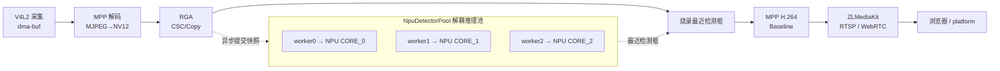
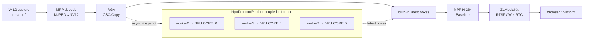

<div align="center">

# EdgeVision-RK3588

**RK3588 端侧实时视觉：三核 NPU 加速 YOLO + WebRTC 网页监控平台**
**RK3588 edge real-time vision: triple-NPU accelerated YOLO + WebRTC web monitoring**


[中文](#中文) · [English](#english)

</div>

---

<a name="中文"></a>

## 中文

RK3588 平台的端到端实时视频处理与 YOLO 目标检测项目，配套一个连接开发板的网页监控平台。
链路：`V4L2 采集 → MPP 硬解码 → RGA → YOLO NPU 推理 → MPP H.264 编码 → ZLMediaKit(RTSP/WebRTC) → 浏览器`。

仓库分两部分：
- **[`firmware/`](firmware/)** — 板端程序（C++17）：采集/推理/编码/推流 + 控制接口。
- **[`platform/`](platform/)** — 网页监控平台（Node.js，零依赖）：连板子、看实时画面、切摄像头、开关识别。

### ✨ 亮点

- **三核 NPU 并行**：为 RK3588 的 3 个 NPU 核各建一个推理实例（`rknn_dup_context` 共享权重 + `rknn_set_core_mask` 绑核），实测推理吞吐 **2.8–3.4×**。
- **推理与视频解耦**：推理移出视频主链路、跑在独立 worker 线程池；视频线程每帧只烧录"最近一次"检测框 → **视频恒定 30fps**，不再被推理拖慢（改造前用 yolov8s 时视频从 30 掉到 25.5fps）。
- **全链路零拷贝 DMABUF**：采集/解码/RGA/编码之间用 dma-buf fd 传递，减少内存拷贝。
- **WebRTC 低延迟网页监控** + RTSP 拉流；运行时**切换摄像头**（自动枚举 + 失败自愈回退）与**开关识别**。
- **面向 WebRTC 的兼容性处理**：H.264 Constrained Baseline、自动设置 ICE `externIP`，避免"信令成功但画面连不上"。

### 架构



> 关键点：推理不在视频主链路上——视频线程每帧只"烧录最近一次检测框"，检测在独立线程池里用三核并行跑。

### 性能（实测于 RK3588S）

推理吞吐（`YOLO_BENCH` 压测，不受摄像头 30fps 限制）：

| 模型 | 单实例(1 核) | 三实例(3 核) | 加速比 |
|---|---|---|---|
| yolov8n | ~37–43 fps | **~122–126 fps** | **~3×** |
| yolov8s | ~28 fps | **~70–78 fps** | **~2.7×** |

视频帧率（真实链路，1080p@30）：yolov8s 单核耦合时视频掉到 **25.5fps**；三核解耦后视频稳定 **30fps** 且检测零掉帧。

### 快速开始

**板端（firmware）**
```bash
cd firmware
cmake -S . -B build && cmake --build build -j$(nproc)
# 准备模型：把 yolov8n.rknn + coco_80_labels_list.txt 放到 firmware/model/（见 firmware/model/README.md）
sudo scripts/perf_setup.sh                       # 可选：锁频，压满三核
CAMERA_EXCLUDE=/dev/video12 ./build/bin/app      # 启动
```

**网页平台（platform）**
```bash
cd platform
# 编辑 config.json 填开发板 IP，或用环境变量：
CAM_BOARD_HOST=<BOARD_IP> npm start
# 浏览器打开 http://<运行平台的主机>:8090
```

> ⚠️ 开发板若开了防火墙，需放行端口：`sudo ufw allow 8001 && sudo ufw allow 8000 && sudo ufw allow 8554 && sudo ufw allow 8090`（WebRTC 媒体走 8001）。

### 文档

| 文档 | 说明 |
|---|---|
| [架构 architecture](docs/zh/architecture.md) | 链路、线程模型、NPU 池解耦设计 |
| [编译 build](docs/zh/build.md) | 依赖、编译、模型准备、锁频 |
| [使用 usage](docs/zh/usage.md) | 运行、环境变量、网页操作、systemd 自启 |
| [接口 api](docs/zh/api.md) | `/api/*` 控制接口 + WebRTC 协商 |
| [性能 performance](docs/zh/performance.md) | 基线对比与压测方法 |
| [排障 troubleshooting](docs/zh/troubleshooting.md) | WebRTC 连不上、端口占用、摄像头等 |

English docs: [`docs/en/`](docs/en/)。

### 致谢 / 上游

- [JoeChen2me/RK-MediaProject](https://github.com/JoeChen2me/RK-MediaProject) — 视频链路的重要参考
- [ZLMediaKit](https://github.com/ZLMediaKit/ZLMediaKit) — 流媒体（RTSP/WebRTC）能力
- [Rockchip rknn-toolkit2 / rknn_model_zoo](https://github.com/airockchip/rknn-toolkit2) — NPU 推理与 YOLO 模型/后处理参考
- 三核多实例（`rknn_dup_context`）范式参考自 Rockchip 社区的 rknn_pool 实现

第三方预编译库与许可见 [THIRD_PARTY_NOTICES.md](THIRD_PARTY_NOTICES.md)。

### License

[MIT](LICENSE)

---

<a name="english"></a>

## English

End-to-end real-time video processing with YOLO object detection on RK3588, plus a web monitoring
platform that connects to the board. Pipeline:
`V4L2 capture → MPP decode → RGA → YOLO NPU → MPP H.264 encode → ZLMediaKit (RTSP/WebRTC) → browser`.

Two parts:
- **[`firmware/`](firmware/)** — on-board program (C++17): capture / inference / encode / stream + control API.
- **[`platform/`](platform/)** — web monitoring platform (Node.js, zero-dependency): connect, live view, switch cameras, toggle detection.

### ✨ Highlights

- **Triple-NPU parallelism** — one inference instance per RK3588 NPU core (`rknn_dup_context` shares
  weights + `rknn_set_core_mask` pins cores), measured **2.8–3.4×** inference throughput.
- **Inference decoupled from video** — inference runs in a dedicated worker pool; the video thread only
  burns in the *latest* detections each frame → **rock-solid 30fps video** (vs. dropping to 25.5fps with
  yolov8s in the old coupled design).
- **Zero-copy DMABUF** across capture/decode/RGA/encode.
- **Low-latency WebRTC web monitoring** + RTSP; **runtime camera switching** (auto-enumerate + self-healing
  fallback) and **detection on/off**.
- **WebRTC-ready encoding** — H.264 Constrained Baseline + automatic ICE `externIP`, avoiding the classic
  "signaling OK but video won't connect".

### Architecture



### Performance (measured on RK3588S)

Inference throughput (`YOLO_BENCH`, not capped by the 30fps camera):

| Model | 1 instance (1 core) | 3 instances (3 cores) | Speedup |
|---|---|---|---|
| yolov8n | ~37–43 fps | **~122–126 fps** | **~3×** |
| yolov8s | ~28 fps | **~70–78 fps** | **~2.7×** |

Video FPS (real pipeline, 1080p@30): yolov8s in the old coupled design dropped to **25.5fps**; the
decoupled triple-core design holds a steady **30fps** with zero detection drops.

### Quick start

**Firmware**
```bash
cd firmware
cmake -S . -B build && cmake --build build -j$(nproc)
# Models: put yolov8n.rknn + coco_80_labels_list.txt into firmware/model/ (see firmware/model/README.md)
sudo scripts/perf_setup.sh                       # optional: lock clocks
CAMERA_EXCLUDE=/dev/video12 ./build/bin/app
```

**Web platform**
```bash
cd platform
CAM_BOARD_HOST=<BOARD_IP> npm start
# open http://<platform-host>:8090
```

> ⚠️ If the board has a firewall, open the ports (WebRTC media uses 8001):
> `sudo ufw allow 8001 && sudo ufw allow 8000 && sudo ufw allow 8554 && sudo ufw allow 8090`.

### Docs

See [`docs/en/`](docs/en/): [architecture](docs/en/architecture.md) · [build](docs/en/build.md) ·
[usage](docs/en/usage.md) · [api](docs/en/api.md) · [performance](docs/en/performance.md) ·
[troubleshooting](docs/en/troubleshooting.md).

### Acknowledgements

[JoeChen2me/RK-MediaProject](https://github.com/JoeChen2me/RK-MediaProject),
[ZLMediaKit](https://github.com/ZLMediaKit/ZLMediaKit),
[rknn-toolkit2 / rknn_model_zoo](https://github.com/airockchip/rknn-toolkit2). Third-party binaries and
licenses: [THIRD_PARTY_NOTICES.md](THIRD_PARTY_NOTICES.md).

### License

[MIT](LICENSE)
